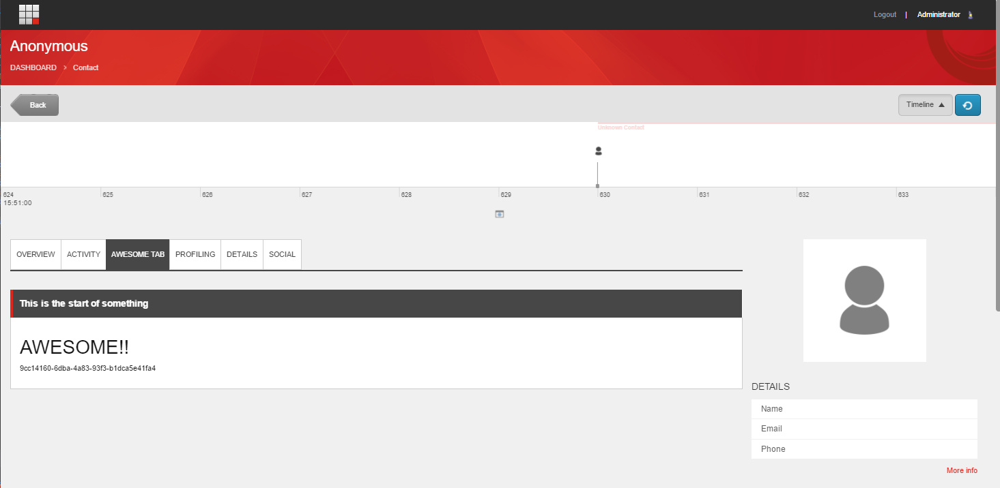
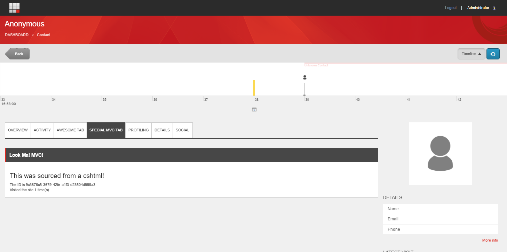

# Experience Profile Express Tab
The purpose of the EPExpress Tab module is to streamline the creation of new tabs into the Experience Profile.  Normally to do this involves a many step process that you can read about [here](https://community.sitecore.net/technical_blogs/b/getting_to_know_sitecore/posts/using-custom-contact-data-part-1-experience-profile).

## A Better way
By Automating the process and simplifying the output we can convert this process into a format that's a little more familiar to the average web developer by Looking at this from the perspective of a standard MVC setup
This can be as simple as a single step process.

## Installation
This is available by nuget, there are two packages available [here](https://www.nuget.org/packages/EPExpressTab/) for the binary and config or [here](https://www.nuget.org/packages/EPExpressTab.Core/) if you just need the binary and are planning to manually install the config.
```xml
<?xml version="1.0"?>
<configuration xmlns:patch="http://www.sitecore.net/xmlconfig/">
	<sitecore>
		<pipelines>
			<initialize>
				<processor type="EPExpressTab.Pipelines.Initialize.Initialize, EPExpressTab" >
				</processor>
			</initialize>
		</pipelines>
	</sitecore>
</configuration>
```
## Get started quick
Can we make a new Experience Profile tab in 9 lines of code?  yes we can!
```cs
	public class EpExpressDemo : EpExpressModel
	{
		public override string TabLabel => "Awesome Tab";
		public override string Heading => "This is the start of something";
		public override string RenderToString(Guid contactId)
		{
			Sitecore.XConnect.Contact model = EPRepository.GetContact(contactId, "Your Custom Facet Key");
			
			return $"<h1>AWESOME!!</h1><p>{model.ContactId}</p>";
		}
	}
```

## How does this work?
using an initialize pipeline process we're able to detect implementations of the EpExpressModel base class and automatically register them with Sitecore in a similar way that would happen manually with Speak and Rocks.
It then utilizes a custom rendering engine based off of the Method Rendering in Sitecore to wire up the current contact to your custom built method.  It really can be that easy!

## But wait!  I thought you said MVC, this isn't MVC!
You're right, the basic example above it the bare bones way to build a tab.  The proper way would be to treat your EpExpressModel class as your controller action, build a custom model, and implement a cshtml view.
To do this use the EpExpressView base class instead of EpExpressModel
```cs
	public class EpExpressViewDemo : EpExpressViewModel
	{
		public override string Heading => "Look Ma!  MVC!";
		public override string TabLabel => "Special MVC Tab";
		public override object GetModel(Guid contactId)
		{
			Sitecore.XConnect.Contact contact = EPRepository.GetContact(contactId, "Your Custom Facet Key");

			return new EpExpressDemoModel
			{
				ContactId = contact.ContactId.ToString(),
				VisitCount = (int)((dynamic)contact).VisitCount
			};
		}
		public override string GetFullViewPath(object model)
		{
			return "/views/EpExpressDemo.cshtml";
		}
	}
```
And here is our model.
```cs
	public class EpExpressDemoModel
	{
		public string ContactId { get; set; }
		public int VisitCount { get; set; }
	}
```
And here is our view.
```cshtml
@model EPExpressTab.EpExpressDemoModel
<h3>This was sourced from a cshtml!</h3>
<div>The ID is @Model.ContactId</div>
<div>Visited the site @Model.VisitCount time(s)</div>
```
This results in something that looks like this

## Options
By default the tabs come with the heading and wrapper wired up automatically.  Resulting in the nicely Sitecore branded header bar and wrapper around your custom markup.
You may however want to have complete control over what goes in that tab.  You can do this by overriding the UseDefaultWrapper flag in the base class.
```cs
		public override bool UseDefaultWrapper => false;
```